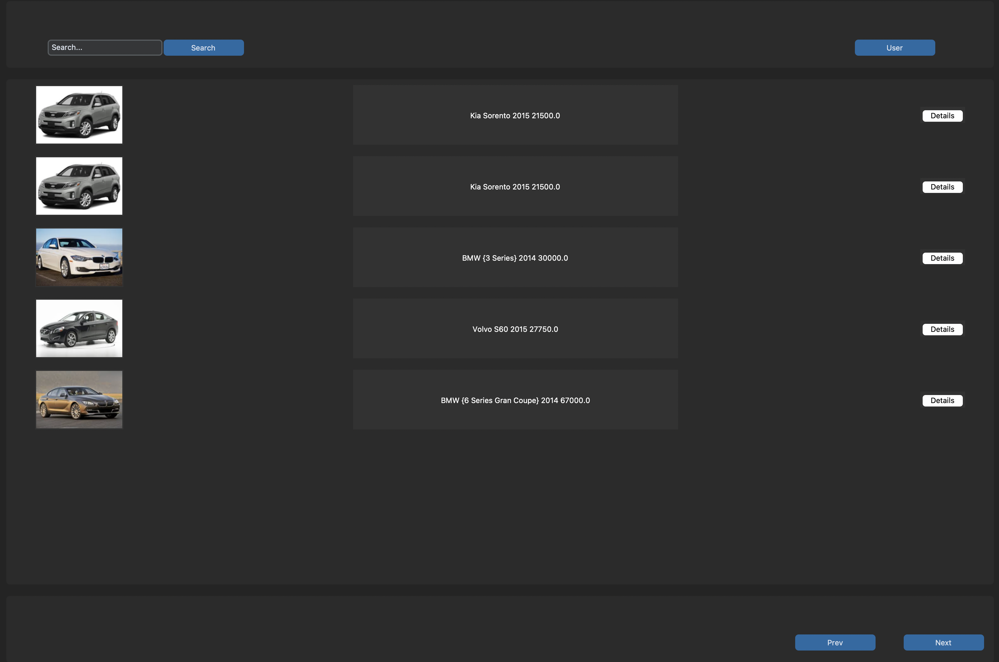
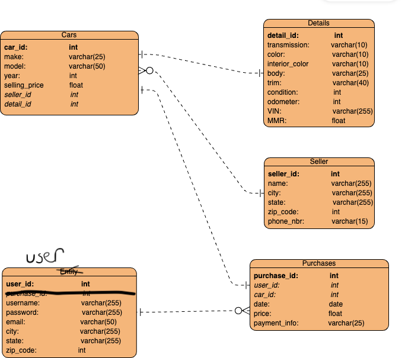
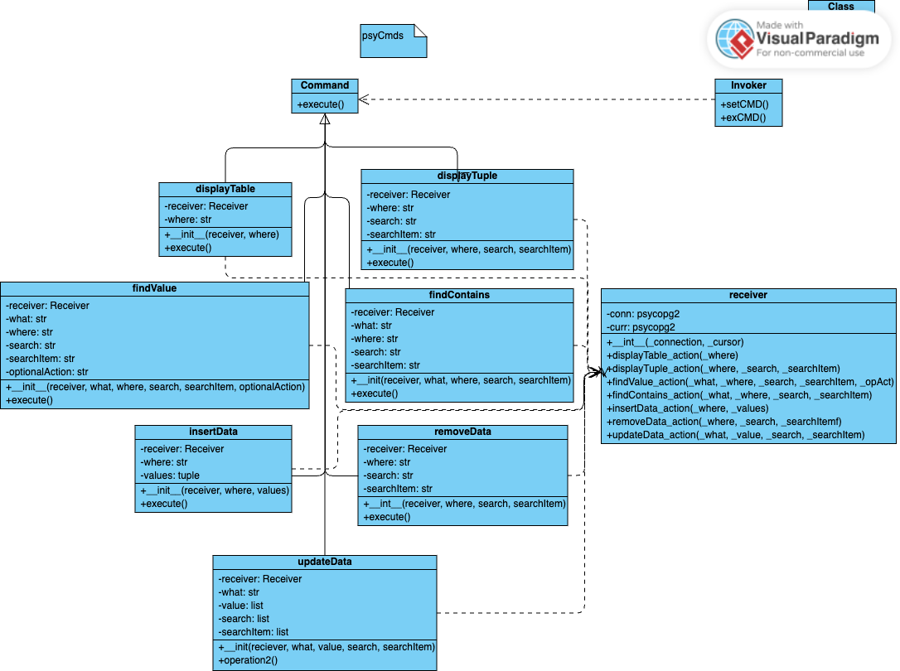
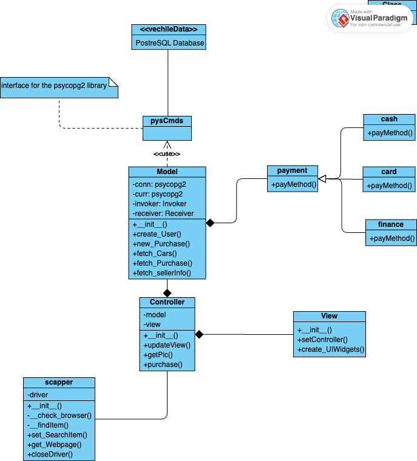

# Mock_VechileSales

## TO-DO

    <ul>
        <li>Fix the details popup to properly display vechile information</li>
        <li>Implement an input buffer</li>
        <ul>
            <li>Have an array of images that is being filled by the background process</li>
        </ul>
        <li>Add a method to remove a user</li>
        <li>Add payment functionalilty</li>
        <ul>
            <li>Collect payment informaiton for a user / Cannot purchase without being logged in</li>
        </ul>
    </ul>

## Goal
This project aims to develop an "online" vehicle sales application. Users can browse a selection of vehicles from various sellers worldwide. In the initial view, the users will see general information about a particular vehicle, including a picture. Clicking a vehicle will present the user with additional information and seller information. Once a “purchase” has been made, the vehicle is shipped to the users; a record of the purchase is made on the user's account.

## Tech Stack
The front end will be designed using Tkinter and customtkinter. These libraries provide a customizable interface, allowing for a user-friendly experience. To manage the interactions with the database, the psycopg2 library will be utilized through a custom command interface that provides an abstraction 
from the SQL queries. Finally for the back end, we will be implementing a webscrapper that will be used to retrieve pictures of the vehicles. This functionality will be implemented using the selenium and retrying libraries; PIL library will be used to display these images

## Infrastructure
The setup involves a client-server model featuring a desktop application and a PostgreSQL database. We will develop the desktop app using a framework that seamlessly integrates with PostgreSQL. The database will reside on a dedicated server to uphold performance and security standards. Additionally, the system will be engineered for scalability and ready to accommodate future growth. This configuration promises a sturdy and dependable infrastructure for the application.

## Data Source
The data source for this project can be found on Kaggle 
(https://www.kaggle.com/datasets/syedanwarafridi/vehicle-sales-data/data); this will provide us with a single CSV file that contains the following tuples (year, make, model, trim, body, transmission, vin, state, condition, odometer, color, interior, seller, MMR, selling price, sale date). We must break this into three tables: cars, details, and seller. The car's table will have general information about the car. The 
detail table will provide further information about a vehicle. Finally, the seller table will have general information about the seller. The users and purchases tables will be populated based on the user's interaction with the program.

## ERD

## UML

## Interactions
The model will interact with the vechileData database through the psyCmds command interface. It's equipped to handle multiple payment methods for user payments. Data fetched from the database will be relayed to the controller, and the view will be updated accordingly. Additionally, a scraper is utilized to fetch vehicle images, which are then passed to the controller for view updates.